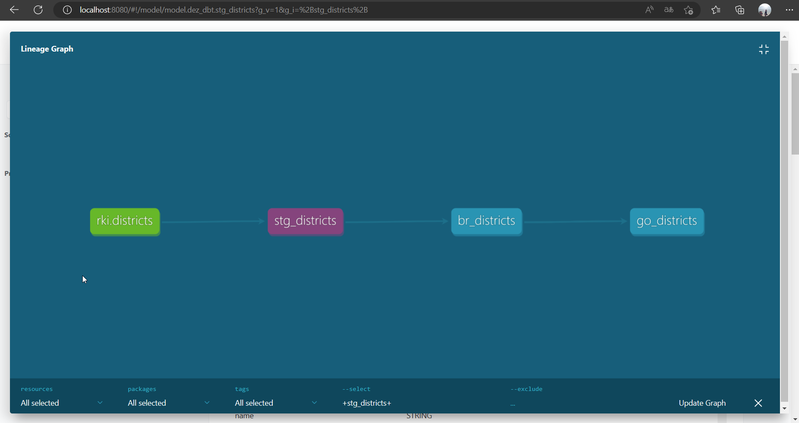
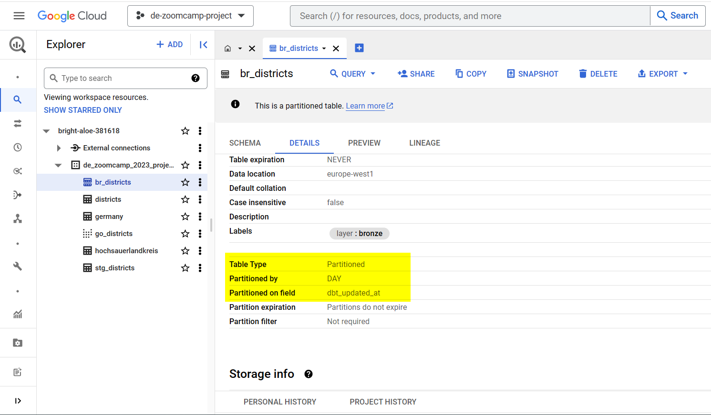

## Image of the dbt lineage created by the tool based on the references between the sources and models/snapshots as a DAG.

- rki.districts reflects the source data from the RKI API, which is already located "in the lowest layer" of the DWH.
- stg_districts casts the column data types and filters out rows where ags (Allgemeiner Gemeindeschlüssel) is null.
- br_districts is a dbt snapshot and thereby automatically implements type-2 Slowly Changing Dimensions. Additionally the target table is partitioned by dbt_updated_at on a daily granulartiy.

- go_districts calculates key figures in the form of share calculations.

Yes, I skipped the silver layer in this case :blush: