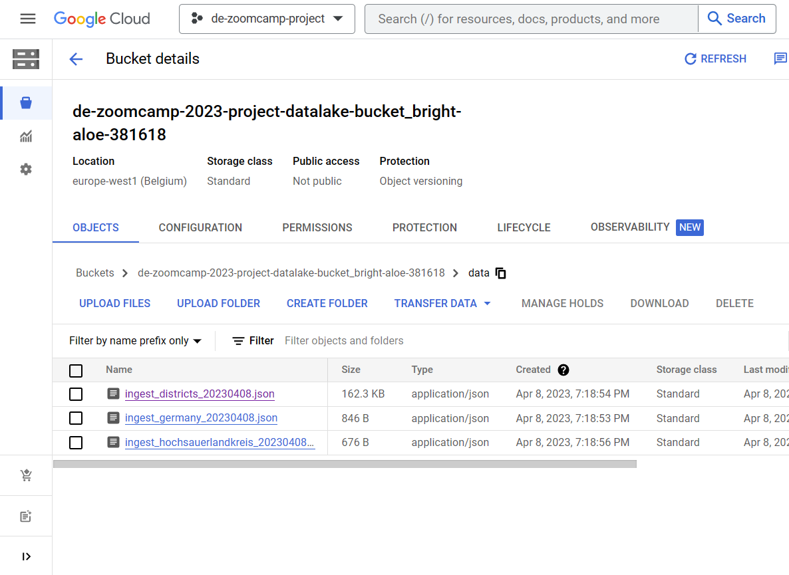

## Insight into the Google Cloud Storage Bucket. This is where the raw data from the API resides in JSON format. For easier processing/identification, the file name contains the topic/table and the extraction date.

## Insight into Google BigQuery. Here you can see the tables and views in the dataset.

