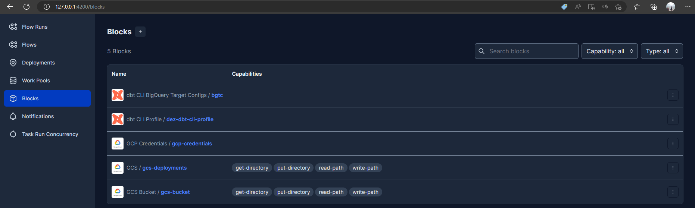
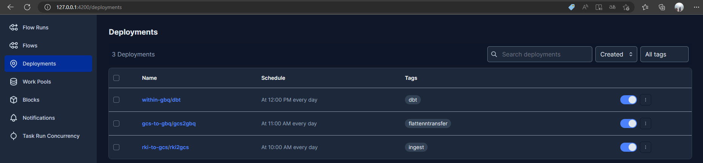
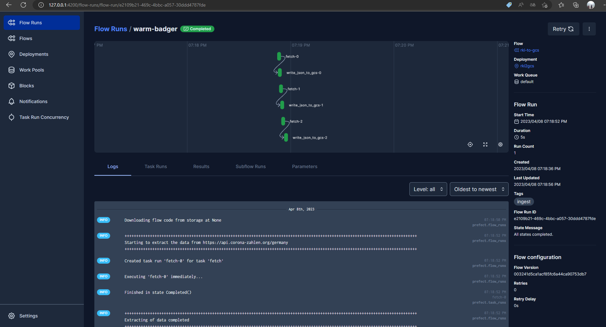
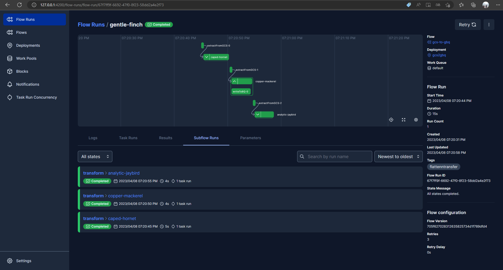
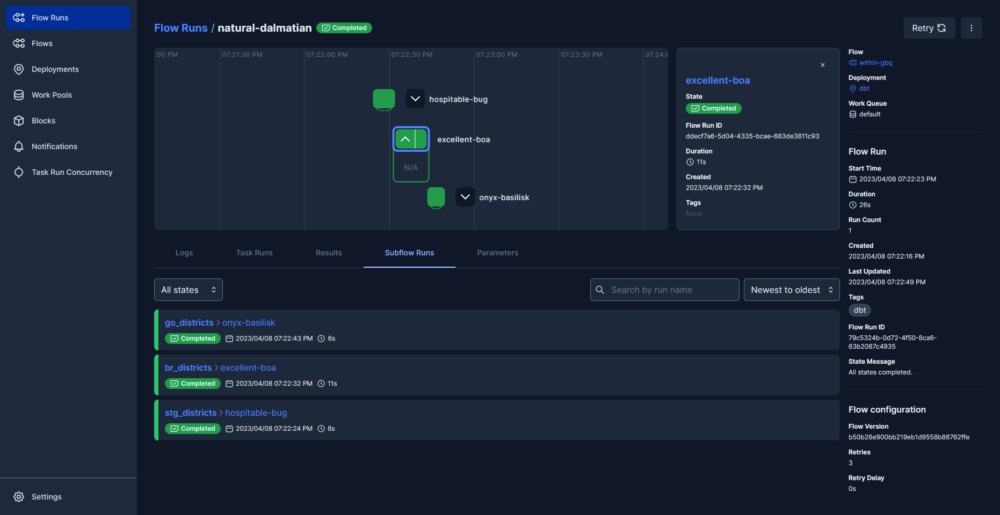
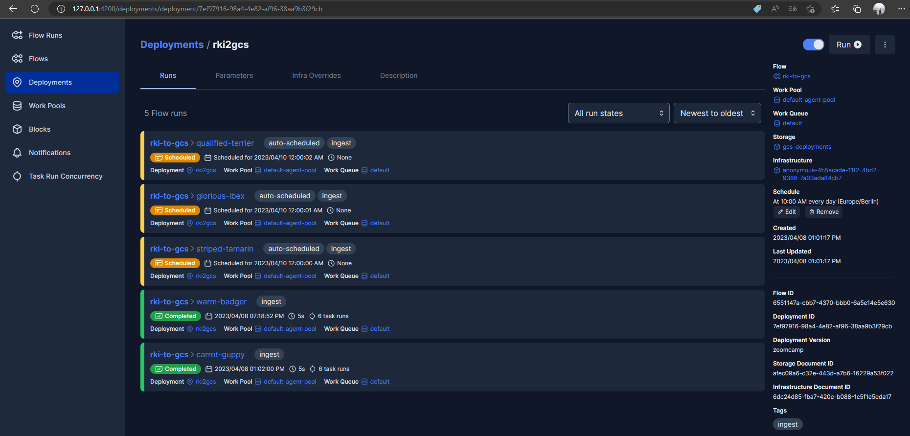

## The following prefect blocks have been implemented. These contain, for example, the credentials and establish the connection to the external systems.

## The following deployments orchestrate the workflows and thus map the entire processing of the data. They have also been scheduled and therefore run automatically on a regular basis. In this case, they are scheduled. Alternatively, the individual processes could be further interlocked so that the subsequent processes start immediately after successful completion of the predecessor.

## Example flow run in the Prefect UI (in this case of the ingest process from RKI API to GCS bucket). This flow extracts data from all three endpoints. It is divided into smaller sub-tasks. In addition, manual log messages have been implemented, which can be seen in the log section below. 

## Example flow for flattening and transferring data from the GCS bucket towards Google BigQuery. This flow is now also divided into sub-flows.

## Sample flow for orchestrating dbt models and snapshots.

## Overview of past and planned flows of the rki2gcs deployment.

